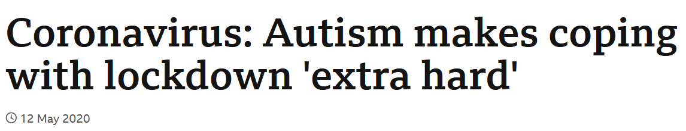
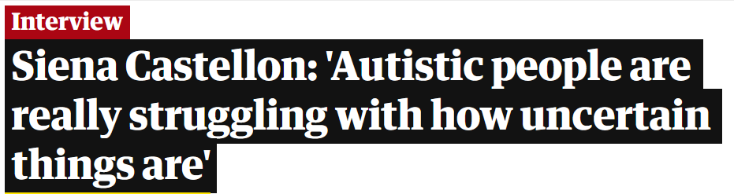
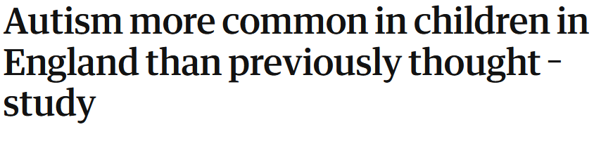

```{r setup, include=FALSE}
knitr::opts_chunk$set(echo = TRUE)
library(here)
library(tidyverse)
library(extrafont)
```

# **Changes in the number of referrals for autism diagnostic assessment before, during, and after lockdown in England by age group:**

## Research Question

How did the pandemic affect the number of referrals for autism assessments in NHS practices and did this vary by age? 

The pandemic resulted in school closures and disruption in routine for most children in England giving parents unprecedented amounts of time around their school-aged children and also resulting in a period of stress and uncertainty, providing an environment for the exacerbation of symptoms of autism that would be visible to caregivers. This may have created a situation in which parents where well placed to identify potential autism in their children in a way in which they were unable to before. This period of stress and uncertainty also may have exacerbated previously unnoticed symptoms in undiagnosed adults prompting an increase in referrals in older age groups.



*https://www.bbc.co.uk/news/uk-scotland-52618931*  

*https://www.bbc.co.uk/news/uk-england-tyne-60885874*  

*https://www.theguardian.com/society/2020/nov/11/siena-castellon-autistic-people-are-really-struggling-with-how-uncertain-things-are*  

*https://www.theguardian.com/society/2021/mar/29/autism-more-common-in-children-in-england-than-previously-thought-study*


## The Data:

Data was taken from NHS digital who began publishing monthly statistics for the number of autism referrals (amongst other variables such as wait time) for practices in England. The data used here is the result of merging two datasets covering April 2019 - December 2021 and July 2021 - June 2022 and these datasets can be accessed via these links:  
*https://digital.nhs.uk/data-and-information/publications/statistical/autism-statistics/april-2019-to-december-2021*   
*https://digital.nhs.uk/data-and-information/publications/statistical/autism-statistics/july-2021-to-june-2022*

The data was recorded in this format:
Note that column names were abbreviated for the sake of simplicity.

```{r echo=FALSE, warning = FALSE, message = FALSE, options(warn=0)}
library(here)
library("data.table")
install.packages("kableExtra", repos = 'https://www.stats.bris.ac.uk/R/')
Apr19_Dec21 <- read.csv(unz(here("data","Zipped_total_data.zip"),"April2019_Dec2021.csv")) 
brief_glance <- head(Apr19_Dec21[Apr19_Dec21$METRIC == 'ASD12' & 
                                   Apr19_Dec21$SECONDARY_LEVEL != 'NONE'
                                 & Apr19_Dec21$METRIC_VALUE != '*',], n=3)

brief_glance
#below is the alternative code for html output that is not compatible with pdf
#tableh <- knitr::kable(head(brief_glance), "html", col.names = c("RPS","RPE","S","B","PL","PLD","SL","SLD","M","MD","MV"))
#kableExtra:: kable_styling(tableh,bootstrap_options = 
#c("striped", 'condensed', "scale_down" ),position = "left", font_size = 10) 
```


## Data preparation

These datasets were very large and included metrics that this analysis was uninterested in and also had to be merged and duplications deleted. There were also some formatting changes necessary to make the data more understandable to R such as the conversion of data from character to date class. The final stage of this was to sum the referrals by age across practices as this analysis was not focused on region. The full process of data cleaning and pre-processing is illustrated below. 


```{r warning = FALSE, message = FALSE}
#housekeeping
library(tidyverse)
Apr19_Dec21 <- read.csv(unz(here("data","Zipped_total_data.zip"),"April2019_Dec2021.csv")) 
Jul21_Jun22 <- read.csv(unz(here("data","Zipped_total_data.zip"),"July2021_June2022.csv"))

#making a function
fval_tail <- function(df,col_num,value) {
  #find a value in the data fram that matches input, find the element number of the last 
  #instance of this
  index <- which(df[,col_num] == value)
  output <- tail(index,1)
}


#create a new dataframe for the second dataset with only dates after this
lastdupind <- fval_tail(Jul21_Jun22,1,tail(Apr19_Dec21$REPORTING_PERIOD_START, n=1))
nondup_Jun21_Jul22 <- Jul21_Jun22[-c(1:lastdupind),]

#merge
merged <- rbind(Apr19_Dec21,nondup_Jun21_Jul22)
merged_subset <- subset(merged,merged$METRIC == 'ASD12' & 
                          merged$SECONDARY_LEVEL != 'NONE' & 
                          merged$BREAKDOWN != 'CCG - GP Practice or Residence; Age Group')

#format the data classes
classform_ms <- mutate(merged_subset,REPORTING_PERIOD_START = 
                         as.Date(REPORTING_PERIOD_START, format = "%d/%m/%Y")) 
classform_ms <- mutate(classform_ms,REPORTING_PERIOD_END = 
                         as.Date(REPORTING_PERIOD_END, format = "%d/%m/%Y"))
classform_ms <- mutate(classform_ms,METRIC_VALUE = as.numeric(METRIC_VALUE))

#removing any NA/unknown values
valonly_full <- classform_ms[!is.na(classform_ms$METRIC_VALUE),]
valonly_full <- classform_ms[classform_ms$SECONDARY_LEVEL != "UNKNOWN",]

#making the legend label order in age order
valonly_full$SECONDARY_LEVEL[valonly_full$SECONDARY_LEVEL == 'Under 18'] <- '0 - 17'

#Sum by age and date
ref_age_date <- aggregate(METRIC_VALUE ~ REPORTING_PERIOD_START + SECONDARY_LEVEL, 
                          data = valonly_full, FUN = "sum")
ref_age_date <- data.frame(ref_age_date)

```


## Initial visualisation

I initially visualised the data using a scatter plot but found it difficult to interpret as the points were small and often overlapped, especially for the older age groups with smaller referral numbers.
 
 
```{r echo= TRUE, warning = FALSE, message = FALSE, fig.width= 11,fig.height= 6}
initialplot <- ggplot(ref_age_date, aes(x = REPORTING_PERIOD_START, 
                                        y = METRIC_VALUE, color = SECONDARY_LEVEL)) +
  geom_point(size = 1.5) +
  labs(title = "New autism referrals each month by age from 2019-mid2022", 
       x = "date", y = "Number of New Referrals") +
  guides(color=guide_legend("Age Group"))+
  scale_color_manual(values=c("#FF6A6A", "#FFA54F", "#FFEC8B", "#90EE90", 
                              "#7EC0EE","#7A67EE","#8B8386")) + 
  geom_point(shape = 1,size = 1.5,colour = "black")

plot(initialplot)

```


I next tried visualising the data as a stacked bar chart. This is because I wanted the 
number of referrals and categories to be more visible and because I wanted to highlight 
the age group composition and make the proportions more directly comparable. This visualisation method also works well with the data's discerete age group categories.


```{r echo= TRUE,warning = FALSE, message = FALSE, fig.width= 11,fig.height= 6}
library(extrafont)

# x values for annotations on barplot
lockdown1 <- fval_tail(ref_age_date,1,"2020-03-01")
lockdown_text_placement <- fval_tail(ref_age_date,1,"2020-02-01")

# designing plot
barplot <- ggplot(ref_age_date, aes(x=REPORTING_PERIOD_START,
                                    y=METRIC_VALUE)) +
  geom_bar(aes(fill=SECONDARY_LEVEL), stat='identity', 
           colour='black', width=20)+ 
  scale_y_continuous(breaks=seq(0,10000,500),expand = c(0,0), 
                     limits = c(0, 10000))+
  scale_x_date(date_breaks = '1 month', date_labels = "%b-%Y", 
               expand = expansion(add = 2))+
  theme(axis.text.x=element_text(angle=60, hjust=1),
        plot.title=element_text(family='Times', face="bold", 
                                size=20,hjust = 0.5, vjust = 0.5),
        axis.text = element_text(family="Times", colour = "black"),
        legend.text = element_text(family="Times", colour = "black", 
                                   face = "bold"), 
        legend.background = element_rect(fill = "#C1CDCD",linetype = 1, 
                                         colour = "black", linewidth = 1),
        legend.title = element_text(family="Times", colour = "black", 
                                    face = "bold", size = 12),
        panel.border = element_rect(colour = "black", fill = NA, 
                                    linewidth = 2),)+
  labs(title="New autism referrals each month by age from April 2019 - June 2022", 
       x="Date", y="Number of Referrals Across England", fill = "Age Groups:")+
  scale_fill_manual(values=c("#FF6A6A", "#FFA54F", "#FFEC8B", "#90EE90", 
                             "#7EC0EE","#7A67EE","#FFF0F5"))+
  geom_vline(xintercept = ref_age_date[lockdown1,1])+
  annotate("text", x= ref_age_date[lockdown_text_placement,1], y=7600, 
           label="Start of 1st Lockdown in England", angle=90)

#viewing the bar chart
plot(barplot)
```


Finally, to emphasise the time course component of this data I animated the plot so that the data would be gradually revealed along the x-axis. This draws attention to trends over time in the data alongside differences in age-group proportions.


```{r fig.show='animate', fig.width = 11, fig.asp = 0.6,interval = 0.1}
install.packages('tinytex',repos = 'https://www.stats.bris.ac.uk/R/')
tinytex::install_tinytex(force = TRUE)
library(gganimate)
anim2 <- barplot + 
  transition_states(REPORTING_PERIOD_START,transition_length = 2,
                    state_length = 1) + 
  shadow_mark() 
anim2
```


## Conclusions:
 
There is a clear decrease in autism referrals after the initial COVID-19 lockdown and a steady increase over the next two years resulting in a rough doubling of referral numbers between the last half of 2019 and the first half of 2022. The magnitude of the increase appears to be relatively similar for all age groups under 45; however, 45 - 54, 55 - 64 and 65+ year olds do not appear to show much change across time in terms of a clear trend towards either increase or decrease (although there is month-by-month variability).Therefore, lockdown and the post-lockdown period is associated with an approximate doubling of autism referral numbers for under 45s and no apparent change in over 45s. 

However, this data is visualisation is limited in terms of its ability to answer the research question in that it only considers data from NHS CCGs (Clinical Commissioning Groups) and data submission is voluntary for non-NHS funded referrals. This means that data concerning private referrals is largely missing. People may be more likely to seek a private referral if they have struggled to obtain one from their NHS GP and as a result this may mean the referral numbers for adults is underestimated as autism is still traditionally seen as a condition only impacting or being diagnosed in children. 

It would be interesting to see if this pattern varied geographically given that the data was recorded for each practice centre and so could be plotted onto a map or potentially to look at the breakdown of these results by sex as there is a disparity in the number of males vs females diagnosed with autism (generally ranging from 5:1-2:1 depending on the study, [Napolitano et al 2022](https://www.frontiersin.org/articles/10.3389/fpsyt.2022.889636/full#B4)) and it would be interesting to see if this is reflected by a similar trend for referrals or if this is a pattern that emerges at the assessment stage of diagnosis.


